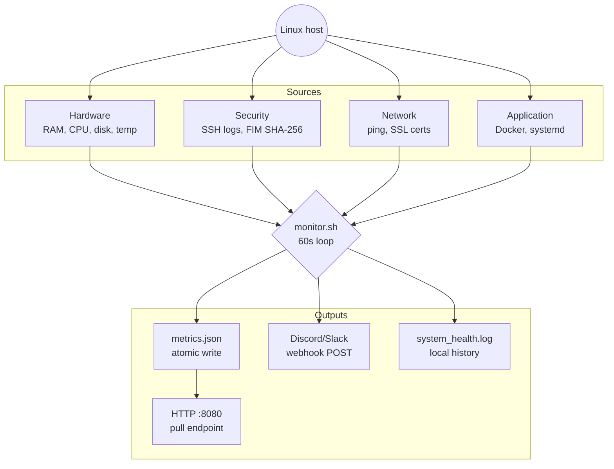

[](https://ghcr.io/maxime2476/linux-sys-monitor)


# linux-sys-monitor

A bash daemon that monitors a Linux server's health and sends alerts to Discord/Slack via webhook. Designed for bare-metal servers and VPS instances — no external dependencies beyond standard Unix utilities.

The script runs in a loop (default every 60s), collects metrics, writes them as JSON to disk, and fires webhook notifications when thresholds are breached.

## Architecture

```
monitor.sh (main loop, 60s interval)
├── Hardware: RAM, disk, CPU load, temperature
├── Security: SSH failed logins, file integrity (SHA-256)
├── Network: packet loss via ping, SSL cert expiry
├── Application: Docker container health, systemd service self-healing
├── Output: metrics.json (atomic write via tmp file)
├── Web server: python3 -m http.server (optional, port 8080)
└── Alerts: webhook POST (Discord/Slack, 5-min throttle)
```



## Setup

### Bare-metal / VPS (systemd)

```bash
git clone https://github.com/maxime2476/linux-sys-monitor.git
cd linux-sys-monitor
cp monitor.conf.example monitor.conf
# edit monitor.conf with your values
sudo make install
```

Check status:

```bash
sudo systemctl status linux-sys-monitor
sudo journalctl -u linux-sys-monitor -f
```

### Docker

```bash
cp monitor.conf.example monitor.conf
# edit monitor.conf
docker compose up -d
```

The compose file mounts the current directory into the container, so `monitor.conf` on the host is used. The web endpoint is exposed on port 8080.

To use the pre-built image from GHCR:

```bash
docker pull ghcr.io/maxime2476/linux-sys-monitor:latest
docker run -d --privileged \
  -v $(pwd)/monitor.conf:/app/monitor.conf \
  -p 8080:8080 \
  ghcr.io/maxime2476/linux-sys-monitor:latest
```

## Configuration

Copy `monitor.conf.example` to `monitor.conf` and edit:

| Variable | Description | Default |
|---|---|---|
| `CHECK_INTERVAL` | Loop interval in seconds | `60` |
| `LOG_FILE` | Log filename | `system_health.log` |
| `OUTPUT_FORMAT` | `text` or `json` | `json` |
| `DISK_THRESHOLD` | Disk alert threshold (%) | `80` |
| `SSH_ALERT_THRESHOLD` | Failed SSH logins before alert | `5` |
| `TEMP_THRESHOLD` | CPU temp alert threshold (°C) | `75` |
| `WEBHOOK_URL` | Discord/Slack webhook URL | *(empty = disabled)* |
| `CRITICAL_SERVICE` | systemd service to watch + restart | *(empty = disabled)* |
| `PING_TARGET` | Host to ping for network check | `1.1.1.1` |
| `MAX_PACKET_LOSS` | Packet loss alert threshold (%) | `20` |
| `ENABLE_WEB_SERVER` | Start HTTP server for metrics pull | `true` |
| `WEB_PORT` | HTTP server port | `8080` |
| `FIM_TARGETS` | Space-separated files to hash-check | `/etc/passwd /etc/ssh/sshd_config` |
| `SSL_DOMAINS` | Space-separated domains to check | *(empty = disabled)* |
| `SSL_DAYS_THRESHOLD` | Alert if cert expires within N days | `15` |
| `CHECK_DOCKER` | Monitor stopped/dead containers | `true` |

## Alert system

Alerts are sent as a single batched webhook message per cycle. The notification is **throttled to at most once every 5 minutes** regardless of how many thresholds are breached.

Alert types:
- Disk above threshold
- SSH brute-force attempts
- CPU overheat
- Packet loss / network degradation
- File integrity change (FIM)
- OOM-killer event in dmesg
- SSL certificate expiring soon
- Docker container exited/dead
- systemd service crash + auto-restart result

The self-healing check (`CRITICAL_SERVICE`) is a **systemd-only feature**. When running in Docker, `systemctl` is unavailable and this check is skipped automatically — it won't generate false alerts.

## Metrics endpoint

When `ENABLE_WEB_SERVER=true`, the script starts a local Python HTTP server on `WEB_PORT`. The current state is available at:

```bash
curl http://localhost:8080/metrics.json
```

Writes to `metrics.json` are atomic (write to `.tmp`, then `mv`), so partial reads are not possible.

Sample output:

```json
{
  "timestamp": "2024-01-15T10:30:00+0100",
  "metrics": {
    "hardware": { "ram_used_mb": 512, "ram_total_mb": 2048, "disk_percent": 45, ... },
    "security": { "ssh_failed_attempts": 2, "fim_alert": false, ... },
    "services": { "target": "nginx", "status": "active", "healing_triggered": false, ... }
  },
  "alerts": { "disk_critical": false, "ssh_bruteforce": false, ... }
}
```

## Grafana

Import `dashboards/grafana-dashboard.json` into your Grafana instance. The dashboard reads from the metrics endpoint — configure a JSON datasource pointing to `http://<host>:8080/metrics.json`.

## Log rotation

```bash
sudo cp linux-sys-monitor.logrotate /etc/logrotate.d/linux-sys-monitor
sudo chown root:root /etc/logrotate.d/linux-sys-monitor
# test without rotating:
sudo logrotate -d /etc/logrotate.d/linux-sys-monitor
```

Rotates weekly, keeps 4 weeks of compressed history.

## Makefile

```bash
sudo make install     # deploy systemd service and start it
sudo make restart     # restart the systemd service
sudo make uninstall   # stop, disable, and remove the service
```

## CI

GitHub Actions runs ShellCheck on every push/PR to `main`. Docker image is built and pushed to GHCR on every push to `main`.

## Troubleshooting

**Alerts firing immediately on startup:**
Check that `LAST_ALERT` in the script is working. If you see alerts on the very first cycle, the thresholds in `monitor.conf` may be too low for your system's baseline.

**Self-healing always triggering in Docker:**
`CRITICAL_SERVICE` should be left empty when running in Docker — systemd is not available inside the container. This was a known bug (fixed): empty output from `systemctl` is now treated as "unknown" and skips the healing logic.

**No metrics.json file:**
The script requires a valid `monitor.conf` at startup or it exits immediately. Verify the config is mounted/present.

**HTTP server not responding:**
Check that `ENABLE_WEB_SERVER=true` and the port is not already in use. The Python HTTP server is started once and monitored with `pgrep`; if it dies, it's restarted on the next cycle.

## Local testing

```bash
# Run one-shot with a test config
CHECK_INTERVAL=0 bash monitor.sh

# Watch the metrics file update
watch -n 2 cat metrics.json

# Trigger a disk alert manually (if threshold allows)
DISK_THRESHOLD=1 bash monitor.sh

# Simulate a service being down (bare-metal only)
sudo systemctl stop your-service
# watch the log for healing attempt

# Test webhook manually
curl -X POST -H "Content-Type: application/json" \
  -d '{"content": "test alert"}' "$WEBHOOK_URL"
```
