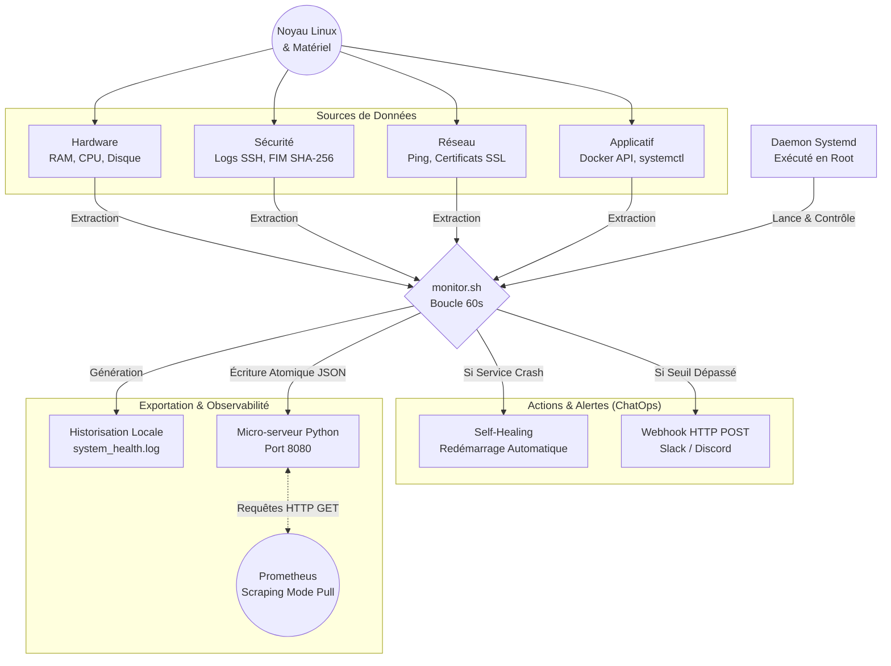

# Linux System Monitor

Un outil en ligne de commande léger (Bash) pour surveiller la santé d'un système Linux. Il enregistre l'utilisation de la RAM, du disque et la charge CPU dans un fichier journal.

## Pourquoi ce projet ?
Ce script est conçu pour offrir une surveillance basique sans avoir à déployer des solutions lourdes comme Prometheus ou Zabbix. Idéal pour des serveurs personnels ou des Raspberry Pi.

## Prérequis
- Un système basé sur Linux ou Unix.
- Les utilitaires standards installés (`bash`, `awk`, `free`, `df`, `uptime`).

## 🏗️ Architecture du Projet



## 🚀 Installation et Usage

L'installation est automatisée via un Makefile :

1. Clonez le dépôt :
   ```bash
   git clone [https://github.com/maxime2476/linux-sys-monitor.git](https://github.com/maxime2476/linux-sys-monitor.git)
   cd linux-sys-monitor
   ```

2. Installez le service :
   ```bash
   sudo make install
   ```

3. Commandes utiles :

   Redémarrer le service :
   ```bash
   sudo make restart
   ```
	
   Désinstaller le service :
   ```bash
   sudo make uninstall
   ```

## Automatisation (Cron)
Pour automatiser ce script afin qu'il s'exécute toutes les heures, ajoutez cette ligne à votre crontab (`crontab -e`) :
```bash
0 * * * * /chemin/absolu/vers/linux-sys-monitor/monitor.sh
```

## Installation en tant que Service (Systemd)

Pour que le script tourne en continu en tâche de fond et survive aux redémarrages du serveur :

1. Créez un lien symbolique de l'unité systemd vers le système :
   ```bash
   sudo ln -s /home/maxime/linux-sys-monitor/linux-sys-monitor.service /etc/systemd/system/
   ```

2. Rechargez les configurations systemd :
   ```bash
   sudo systemctl daemon-reload
   ```

3. Activez (démarrage automatique) et lancez le service :
   ```bash
   sudo systemctl enable linux-sys-monitor.service
   sudo systemctl start linux-sys-monitor.service
   ```

4. Vérifiez l'état du service :
   ```bash
   sudo systemctl status linux-sys-monitor.service
   ```

## Fonctionnalités avancées

### Gestion des alertes
Le script intègre désormais un système d'alerte arithmétique. Par défaut, si l'utilisation de la partition racine `/` dépasse **80%**, une mention `[ALERTE CRITIQUE]` est automatiquement injectée dans le fichier `system_health.log`. 
Cela permet de repérer instantanément les anomalies lors de l'analyse des journaux.

### Gestion des logs (Logrotate)
Pour éviter que le fichier `system_health.log` ne sature l'espace disque, un fichier de configuration `logrotate` est fourni. Il archive les données chaque semaine et conserve un mois d'historique compressé.

Pour l'activer sur votre système, copiez (ou liez) le fichier de configuration dans le répertoire système de logrotate :
```bash
sudo cp linux-sys-monitor.logrotate /etc/logrotate.d/linux-sys-monitor
sudo chown root:root /etc/logrotate.d/linux-sys-monitor
```
Vous pouvez tester la configuration manuellement (sans l'exécuter) avec :
```bash
sudo logrotate -d /etc/logrotate.d/linux-sys-monitor
```

### Collecte robuste des métriques
Pour garantir la stabilité du script indépendamment de la langue (locale) du système d'exploitation, la charge CPU n'est pas extraite via des utilitaires textuels de haut niveau, mais lue directement depuis le pseudo-système de fichiers du noyau (`/proc/loadavg`).

### Export de données structurées (JSON)
Pour faciliter l'ingestion des logs par des outils tiers (ELK, Datadog), le script supporte un mode d'export natif en JSON. Modifiez la variable `OUTPUT_FORMAT="json"` dans le fichier `monitor.conf` pour activer ce mode. Les données respecteront une structure stricte avec horodatage ISO 8601.

### Audit de sécurité
Le script lit les journaux systèmes (`/var/log/auth.log`) pour surveiller les tentatives de connexion SSH échouées. Si le seuil configuré (`SSH_ALERT_THRESHOLD`) est dépassé, une alerte spécifique est déclenchée.

### Notifications ChatOps (Webhooks)
Pour une réactivité immédiate, le script peut envoyer des alertes sur vos plateformes de communication (Slack, Discord, Teams) dès qu'un seuil critique est atteint.
Pour activer cette fonctionnalité, générez un Webhook depuis votre plateforme et collez l'URL dans la variable `WEBHOOK_URL` du fichier `monitor.conf`.

### Auto-Guérison (Self-Healing)
Le script n'est plus seulement passif. Si un service critique (défini via la variable `CRITICAL_SERVICE` dans la configuration) cesse de fonctionner, le daemon tentera de le redémarrer automatiquement via `systemctl` avant d'émettre un rapport de statut via Webhook. L'intervention humaine est ainsi réduite.
*(Note : Cette fonctionnalité requiert que le service s'exécute avec les droits root).*

### Surveillance Thermique (Hardware)
Conçu pour les serveurs Bare-Metal et les nano-ordinateurs (ex: Raspberry Pi), le script lit les capteurs du système de fichiers virtuel (`/sys/class/thermal`) pour surveiller la température matérielle du processeur et alerter en cas de risque de thermal throttling.

### Surveillance Réseau (Packet Loss)
Vérifie la santé de la connectivité sortante du serveur en effectuant des requêtes ICMP (ping) régulières vers une cible externe définie (ex: Cloudflare 1.1.1.1). Une alerte est levée si le taux de perte de paquets dépasse le seuil toléré, signalant une coupure internet ou une saturation de la bande passante.

### Point d'accès HTTP (Mode Pull / Architecture Prometheus)
Pour une intégration native avec les systèmes de supervision modernes (Prometheus, Datadog), le script agit comme un *Node Exporter*. Il expose l'état en temps réel du système sur un serveur web local embarqué.
Si activé dans la configuration (`ENABLE_WEB_SERVER="true"`), vous pouvez requêter les données depuis n'importe quelle machine du réseau :
```bash
curl http://ip_du_serveur:8080/metrics.json
```
*(Les écritures de l'état vers le serveur web sont atomiques, garantissant qu'aucune lecture corrompue ne peut survenir).*

### File Integrity Monitoring (FIM)
Le daemon embarque un moteur de détection d'intrusion basé sur l'hôte (HIDS). Au démarrage, il calcule les empreintes cryptographiques (SHA-256) des fichiers sensibles définis dans `FIM_TARGETS` (ex: `/etc/passwd`). Si une altération non autorisée est détectée durant le cycle d'exécution, une alerte critique de violation d'intégrité est levée.

### Analyse Post-Mortem du Noyau (OOM-Killer)
Pour contrer les fuites de mémoire furtives qui s'effondrent avant le cycle de vérification, le daemon analyse le tampon de messages du noyau (`dmesg`). Toute intervention de l'OOM-Killer (destruction d'un processus due à une saturation de la RAM) est immédiatement comptabilisée et signalée.

### Anticipation d'expiration SSL/TLS
La péremption d'un certificat HTTPS étant une cause majeure de panne de production, le daemon agit comme un client asynchrone. Il interroge via `openssl` les serveurs web définis dans `SSL_DOMAINS`. Il analyse l'empreinte cryptographique X.509 pour calculer la durée de vie restante du certificat. Une alerte réseau est déclenchée automatiquement si la limite (définie par `SSL_DAYS_THRESHOLD`) est franchie.

### Observabilité des Micro-services (Docker)
L'outil s'intègre avec les environnements conteneurisés. S'il détecte la présence du démon Docker (`CHECK_DOCKER="true"`), il interroge l'API locale pour identifier les conteneurs qui ont quitté inopinément ou qui sont dans un état "dead". Les noms des conteneurs impactés sont directement remontés dans la charge utile JSON et via les Webhooks ChatOps.

### 📊 Visualisation (Grafana)
Ce projet inclut un template de Dashboard Grafana (`dashboards/grafana-dashboard.json`). Il permet de visualiser instantanément les métriques collectées par le script. Il suffit d'importer ce fichier JSON dans une instance Grafana pour obtenir une interface de contrôle complète de votre serveur Linux.

### 🐳 Installation via Docker
L'image est construite automatiquement et disponible sur Docker Hub :

```bash
docker pull VOTRE_PSEUDO/linux-sys-monitor:latest
docker run -d --privileged VOTRE_PSEUDO/linux-sys-monitor:latest
```
